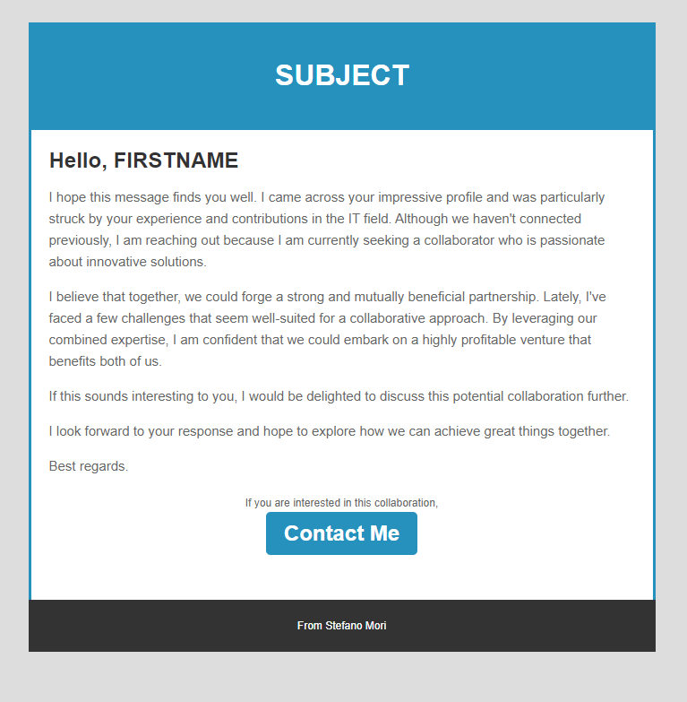

# Email Automation with Tracking for Google Sheets

This Google Apps Script simplifies bulk email sending directly from a Google Sheet while providing real-time email open tracking.

## 📋 Features

- **Custom Menu Integration**  
  Adds an "Email Sender" menu to your Google Sheet for quick access.
- **Bulk Email Sending**  
  Sends personalized emails in bulk, pulling dynamic content from your Google Sheet.
- **Email Open Tracking**  
  Tracks email engagement using a hidden tracking pixel, including:
  - First Open Time
  - Last Open Time
  - Total Open Count
- **Error Handling**  
  Handles errors gracefully to ensure smooth email sending.
- **User-Friendly Dialogs**  
  Provides an intuitive modal dialog for email configuration.

---

## 🛠️ How It Works

1. **Set Up Your Google Sheet**  
   Populate the sheet with the following structure:
   - **Column A**: Recipient Email Address
   - **Column B**: Email Subject
   - **Column C**: Email Body
   - **Column D**: Last Sent Timestamp (auto-updated)
   - **Column E**: First Open Timestamp (auto-updated)
   - **Column F**: Last Open Timestamp (auto-updated)
   - **Column G**: Total Opens (auto-updated)

2. **Send Emails**  
   - Open your Google Sheet.
   - Click on the custom **Email Sender** menu.
   - Select **Send Emails** and input the starting row and number of emails to process.

3. **Track Opens**  
   - A hidden tracking pixel is appended to each email.  
   - Email opens are logged in real-time, updating the Google Sheet automatically.

---

## ✉️ Email Template

The script appends a hidden tracking pixel to your email body to monitor opens.

### Example Email Body in Google Sheet:

| **Recipient**       | **Subject**       | **Body** |
|----------------------|-------------------|----------|
| john.doe@example.com | Welcome to Our Service! | `
Hi John,

Welcome to our service! We're thrilled to have you.

Best, The Team
` |

---

## 📷 Screenshots

Here’s how the script integrates with your Google Sheet:

---

## 🚀 Deployment Steps

1. Replace placeholders in the code:
   - `SHEET_ID`: Your Google Sheet ID.
   - `SHEET_NAME`: Your sheet's name.
   - `Deploy_URL`: The deployed web app URL for tracking.

2. Add the accompanying HTML file (`form.html`) for the email-sending dialog.

3. Deploy the script as a **web app**:
   - Navigate to **Extensions > Apps Script** in Google Sheets.
   - Publish the project as a web app to enable tracking functionality.

---

## 💡 Example Use Cases

- **Marketing Campaigns**: Manage bulk emails for newsletters or promotional offers.
- **Education**: Teachers sending updates or assignments to students while tracking engagement.
- **Team Communication**: Ensure important announcements are read by team members.

---

## ⚠️ Important Notes

Open Tracking is not working. Using only Google App Scripts is impossible to track the statement of emails. I receommend to use Third-Party such as SendGrid, MailGun, or others.

---